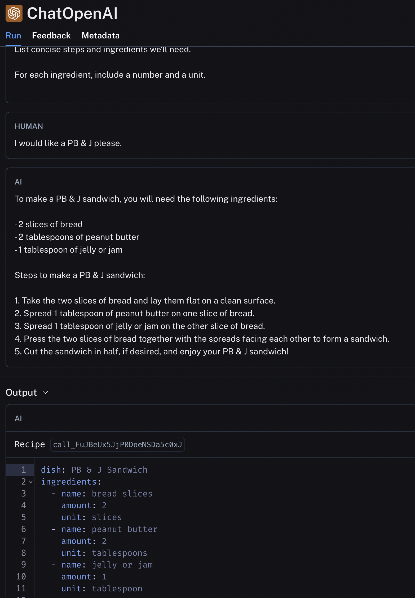
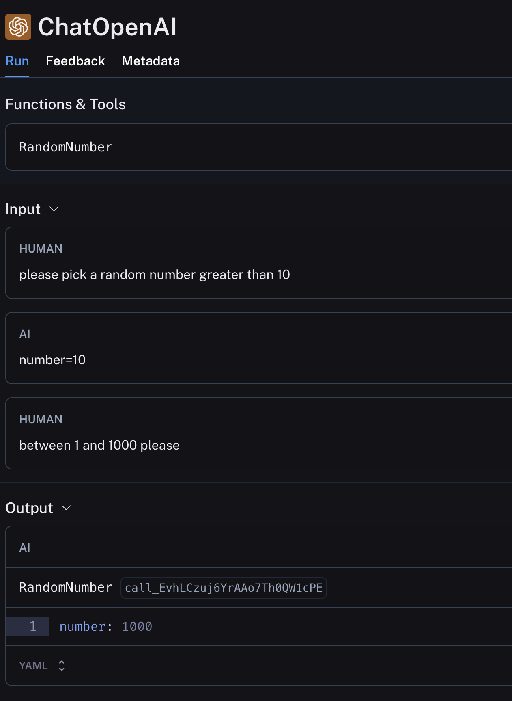

# StatefulChainBuilder

A langchain wrapper that makes writing semi-complex chains slightly easier.

## Use Cases 

### Chain-of-thought use with a tool

Sometimes it's useful to let an LLM think out loud before using a tool. Constraining the output too early can make for dumb answers. The flow is:

1. Set up context (like you normally would)
2. Ask the LLM to solve the problem, allowing it to think out loud and use words
3. Then force tool use to get structured output

Here's a toy example:

```python
class Ingredient(BaseModel):
    name: str
    amount: float
    unit: str

class Recipe(BaseModel):
    dish: str
    ingredients: list[Ingredient]
    steps: list[str]

builder = (
    StatefulChainBuilder(ChatOpenAI(model="gpt-3.5-turbo"))
        .system("""
Tell me how to cook the provided dish. 

List concise steps and ingredients we'll need. 

For each ingredient, include a number and a unit.
        """)
        # Output for this prompt will automatically be saved in history and included
        # in subsequent calls.
        .prompt(messages=[("user", "I would like a {dish} please.")])
        .structured_prompt(Recipe)
)

builder.run({"dish": "PB & J"})
```



### Branching

Writing branching chains can be kind of cumbersome in langchain. It's a little easier with this thing:

```python
class RandomNumber(BaseModel):
    number: int

builder = (
    StatefulChainBuilder(ChatOpenAI(model="gpt-3.5-turbo"))
        .structured_prompt(RandomNumber, "please pick a random number greater than 10")
        .branch(
            condition=lambda x: x.number > 10,
            # the argument here is a cloned instance of the current state
            # of the builder. steps will receive the output from the 
            # step immediately before the branch.
            if_true=lambda b: b.run_lambda(lambda x: x.number / 2),
            if_false=lambda b: (
                b.structured_prompt(RandomNumber, "between 1 and 1000 please")
                .run_lambda(lambda x: x.number / 2)
            )
        )
        .branch(
            condition=lambda x: x > 10,
            # You can also yield constant values with `value_if_true` 
            # or `value_if_false`.
            value_if_true=123,
            if_false=lambda b: b.run_lambda(lambda x: x * 2)
        )
        .run_lambda(lambda x: (
            x + 1
        ))
)

builder.run()
```



## Syntax

### Prompt chaining

The following will embed the entire history into each prompt, simulating a ChatGPT-like interface:

```python
builder = (
    StatefulChainBuilder(ChatOpenAI(model="gpt-3.5-turbo"))
    .system("You're a friendly assistant")
    .run_lambda(lambda x: {"input": x})
    .prompt(
        # you can use prompt variables by using the `messages` argument
        messages=[("user", "here's my question: {input}")], 
        # you can name the output of this step if you want to use it later
        output_field="wordy_answer")
    .prompt(
        "please reword to be more concise", 
        output_field="concise_answer")
)

# This will run the chain
final_response = builder.run("how do i get to the moon?")
# > Traveling to the moon is currently only possible through space missions conducted by space agencies or private companies. Commercial space tourism programs may offer moon trips in the future, but they will likely be expensive and require preparation.

# this will get a chain that you can call `invoke` or `batch` on
# `.run` uses this internally:
chain = builder.build()
responses = chain.batch(["is the sky green?", "how far away is the moon?"])
#> ['The sky is usually blue, not green.',
#   "The average distance from Earth to the moon is approximately 238,855 miles (384,400 kilometers), but it can vary due to the moon's elliptical orbit."]

# this will build a chain similar to RunnablePassthrough.assign where the provided outputs are present in the input dictionary
passthrough_chain = builder.build_passthrough("concise_answer", "wordy_answer")
passthrough_chain.invoke({"question": "write a sentence about how neat the moon is"})
#> {'question': 'write a sentence about how neat the moon is',
#   'concise_answer': 'The moon is incredibly neat.',
#   'wordy_answer': 'The moon is a mesmerizing celestial body that never fails to captivate with its beauty and mystery.'}
```

### Calling lambdas

Sometimes you may want to access inputs passed into the chain. With a lambda you can do this as follows:

```python
import random


builder = (
    StatefulChainBuilder(ChatOpenAI(model="gpt-3.5-turbo"))
    .run_lambda(lambda _: (random.randint(1, 100)))
    .run_lambda(lambda x: x + 1)
    .run_lambda(lambda x, input_number: x * input_number)
)

builder.run(23)
```